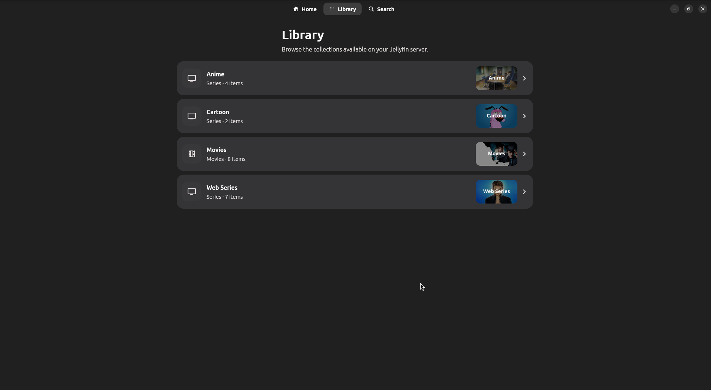
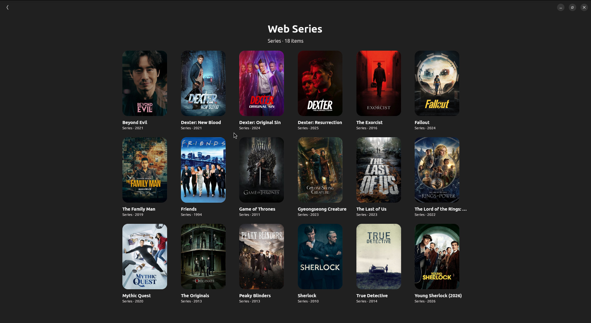
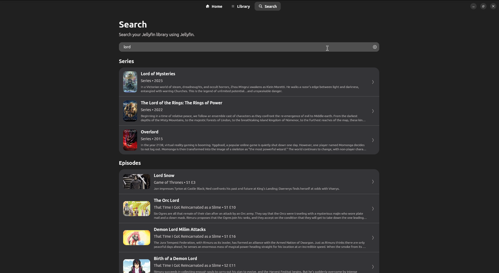

<div align="center">
  <h1>Aetherfin</h1>
  <p>A modern, native-feeling Jellyfin client for Linux, built with Flutter.</p>
</div>

---

## 📖 Overview

Aetherfin is a fully functional Jellyfin client designed specifically for Linux desktops. It embraces the native Linux aesthetic by utilizing a Yaru/libadwaita theme, providing a seamless and visually pleasing experience.

## 🤔 Why Aetherfin?

I previously used and loved [Delfin](https://codeberg.org/avery42/delfin), an excellent Python-based Jellyfin client. However, Delfin is no longer receiving updates. As someone who isn't well-versed in GNOME technologies (like GTK and Python GTK) but has experience with Flutter, I decided to build my own client to fill that void.

When structuring the app, I used the Streamyfin React Native codebase as a reference implementation to help guide the architecture.

## ✨ Features

- **Fully Functional Pages:** Home, Library, Search, Series, and Player pages are all complete and working perfectly.
- **Skip Intro:** Recently integrated "Skip Intro" functionality for a smoother binge-watching experience.
- **Native Aesthetic:** Designed to look and feel right at home on a modern Linux desktop with Yaru styling.

## 🤖 Transparency: Built with AI

I want to be completely upfront about the development process: **~60% of the initial code structuring was generated using AI (ChatGPT Codex).** 

The AI was instrumental in scaffolding the project and writing boilerplate. However, I have personally handled the finalization, UI tweaks, deep code structuring, and state management to ensure it's a solid, reliable application rather than just generated code.

## 📸 Screenshots

Here is a look at Aetherfin in action:

### Home


### Library


### Anime Collection


### Web Series Collection


### Series View


### Search


## 🛠️ Getting Started

To run this project locally, make sure you have Flutter installed.

```bash
# Clone the repository
git clone https://github.com/your-username/aetherfin.git

# Navigate to the project directory
cd aetherfin

# Get dependencies
flutter pub get

# Run the app (Linux target)
flutter run -d linux
```
